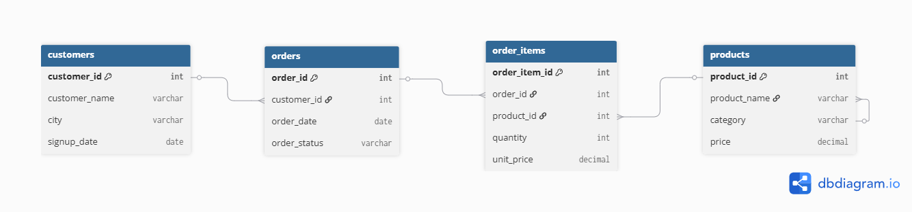
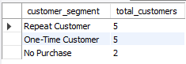
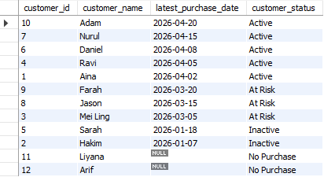
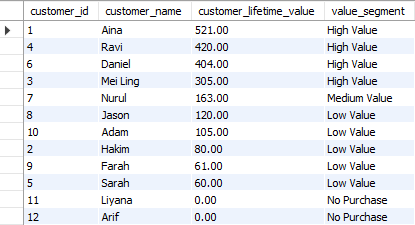
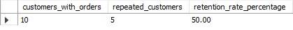
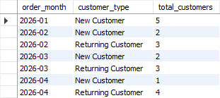
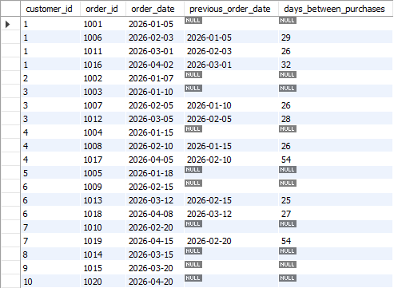
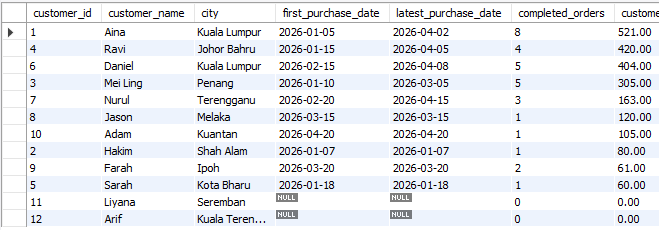

# Customer Retention Analysis Using SQL

## Project Overview

This project analyzes customer purchase behavior using SQL and dummy transactional data. The objective is to understand customer retention patterns, identify high-value customers, evaluate customer activity status, and generate business insights that support customer retention strategies.

The project simulates a real-world customer analytics environment using relational database design and business-focused SQL analysis.

---

## Objectives

* Identify repeat, one-time, and no-purchase customers
* Calculate customer retention metrics
* Analyze customer lifetime value (CLV)
* Classify customers by activity status
* Evaluate purchasing frequency and behavior
* Generate actionable customer retention insights using SQL

---

## Dataset Overview

The project uses dummy customer and transaction data with four relational tables:

* customers
* products
* orders
* order_items

---

## Tools & Technologies

* MySQL
* SQL
* GitHub
* Relational Database Design

---

## SQL Concepts Used

* SELECT
* WHERE
* LEFT JOIN
* GROUP BY
* ORDER BY
* COUNT
* COUNT DISTINCT
* MIN
* MAX
* SUM
* AVG
* COALESCE
* CASE WHEN
* Common Table Expressions (CTEs)
* Window Functions using LAG()
* Customer Segmentation
* Retention KPI Calculation
* Customer Lifetime Value Analysis

---

## Database Schema



---

## Project Structure

```text
Customer-Retention-Analysis/
│
├── README.md
├── schema.sql
├── insert_data.sql
├── analysis_queries.sql
├── insights.md
│
└── screenshots/
    ├── er_diagram.png
    ├── customer_activity_status.png
    ├── customer_retention_rate.png
    ├── customer_value_segment.png
    ├── days_between_purchases_using_lag.png
    ├── full_customer_retention_summary.png
    ├── monthly_new_vs_returning_customer.png
    └── repeat_vs_one-time_vs_no_purchase_customer.png
```

---

## Key Analysis & Results

### Customer Segmentation

Classifies customers into:

* Repeat Customers
* One-Time Customers
* No-Purchase Customers



---

### Customer Activity Status

Identifies customers as:

* Active
* At Risk
* Inactive
* No Purchase

based on their latest purchase activity.



---

### Customer Value Segmentation

Segments customers according to their total spending and overall business value.



---

### Customer Retention Rate KPI

Measures:

* Customers with purchases
* Repeat customers
* Retention rate percentage



---

### Monthly New vs Returning Customers

Tracks customer acquisition and repeat purchasing behavior over time.



---

### Purchase Gap Analysis Using LAG()

Uses SQL window functions to calculate the number of days between customer purchases and understand buying frequency patterns.



---

### Full Customer Retention Summary

Comprehensive customer retention analysis including:

* customer activity status
* purchase frequency
* customer value segment
* retention behavior



---

## Business Insights

* Customers can be segmented into repeat customers, one-time customers, and no-purchase customers.
* Customer retention rates provide visibility into long-term customer loyalty.
* High-value customers contribute a significant portion of revenue and should be prioritized for retention.
* Activity status analysis helps identify customers at risk of churn.
* Purchase gap analysis reveals customer buying frequency and purchasing patterns.
* Customer value segmentation supports targeted marketing and loyalty initiatives.
* Monthly new versus returning customer analysis helps evaluate acquisition and retention performance.

---

## Business Recommendations

* Create win-back campaigns for inactive customers.
* Offer first-purchase incentives to customers who signed up but never completed a purchase.
* Prioritize loyalty programs for high-value repeat customers.
* Monitor monthly new versus returning customer trends.
* Use purchase frequency insights to optimize remarketing campaigns.
* Develop personalized offers based on customer value segments.
* Track retention KPIs regularly to measure the effectiveness of customer retention initiatives.

---

## Future Improvements

* Build a Power BI customer retention dashboard.
* Add customer churn prediction using Python.
* Expand dataset size for more realistic analysis.
* Develop customer cohort analysis.
* Implement customer lifetime value forecasting models.
* Add automated retention reporting and customer health scoring.

---

## Author

Nur Alisha Sukri
